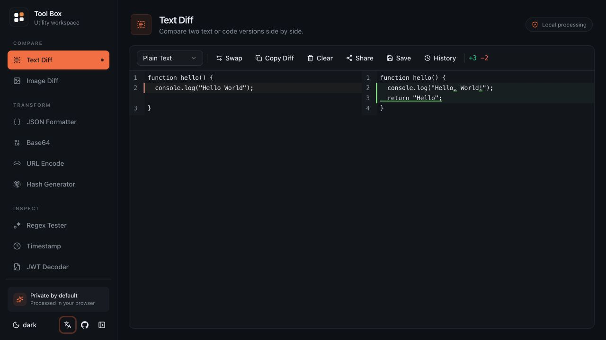

<div align="center">
  <picture>
    <source media="(prefers-color-scheme: dark)" srcset="./public/logo-dark.svg" />
    <source media="(prefers-color-scheme: light)" srcset="./public/logo.svg" />
    
  </picture>

# Tool Box

A fast, private, browser-based workspace for everyday developer utilities.

[Live Demo](https://tool.ziven.me) · [Report a Bug](https://github.com/zeevenn/tool-box/issues) · [Request a Feature](https://github.com/zeevenn/tool-box/discussions)

</div>



## Why Tool Box?

Tool Box keeps the small jobs that interrupt development in one focused workspace. Compare code, format data, inspect tokens, convert values, and generate hashes without sending your content to a server.

- **Private by default** — content is processed locally in your browser.
- **Ready when you are** — no account, upload, or setup is required for the hosted app.
- **Built for daily use** — responsive layout, dark mode, and English / Simplified Chinese UI.
- **Easy to navigate** — tools are grouped into Compare, Transform, and Inspect workflows.

## Tools

| Category  | Tool                | What it does                                                                                                          |
| --------- | ------------------- | --------------------------------------------------------------------------------------------------------------------- |
| Workspace | **Local Drop**      | Hold up to 20 text snippets beside any tool; JSON is formatted for viewing while the original remains copyable.      |
| Compare   | **Text Diff**       | Compare text or code with syntax-aware editors, change statistics, share links, and up to 20 locally saved snapshots. |
| Compare   | **Image Diff**      | Compare two images side by side, as an overlay, with a slider, or through a pixel-difference view.                    |
| Transform | **JSON Formatter**  | Format, minify, validate, and copy JSON with 2- or 4-space indentation.                                               |
| Transform | **Base64**          | Encode and decode text, or load an image as Base64.                                                                   |
| Transform | **URL Encode**      | Encode and decode URL-safe strings in real time.                                                                      |
| Transform | **Hash Generator**  | Generate MD5, SHA-1, SHA-256, and SHA-512 hashes locally.                                                             |
| Inspect   | **Regex Tester**    | Test expressions with `g`, `i`, `m`, and `s` flags and inspect every match.                                           |
| Inspect   | **Timestamp**       | Convert Unix seconds, milliseconds, and date strings into ISO, local, UTC, and relative time.                         |
| Inspect   | **JWT Decoder**     | Inspect JWT headers, payloads, signatures, and expiration status without uploading the token.                         |
| Inspect   | **Color Converter** | Convert between HEX, RGB, and HSL, use the native color picker, or choose a common color.                             |

> [!NOTE]
> JWTs are decoded client-side for inspection only. Their signatures are not verified.

## Run Locally

### Prerequisites

- Node.js 20.19+ or 22.12+
- [pnpm](https://pnpm.io/)

```bash
git clone https://github.com/zeevenn/tool-box.git
cd tool-box
pnpm install
pnpm dev
```

Open [http://localhost:5173](http://localhost:5173) in your browser.

## Available Commands

| Command         | Description                                          |
| --------------- | ---------------------------------------------------- |
| `pnpm dev`      | Start the Vite development server.                   |
| `pnpm build`    | Type-check and create a production build in `dist/`. |
| `pnpm preview`  | Preview the production build locally.                |
| `pnpm lint`     | Check the codebase with ESLint.                      |
| `pnpm lint:fix` | Fix auto-correctable lint issues.                    |

## Tech Stack

- [React](https://react.dev/) and [TypeScript](https://www.typescriptlang.org/)
- [Vite](https://vite.dev/)
- [Tailwind CSS](https://tailwindcss.com/)
- [CodeMirror](https://codemirror.net/)
- [Radix UI](https://www.radix-ui.com/) primitives

## Contributing

Contributions are welcome. Please open an issue or discussion first for larger changes so the approach can be agreed on before implementation.

1. Fork the repository.
2. Create a branch: `git switch -c feature/your-feature`.
3. Make your changes and run `pnpm lint && pnpm build`.
4. Commit and push your branch.
5. Open a pull request.

## License

Released under the [MIT License](./LICENSE).
